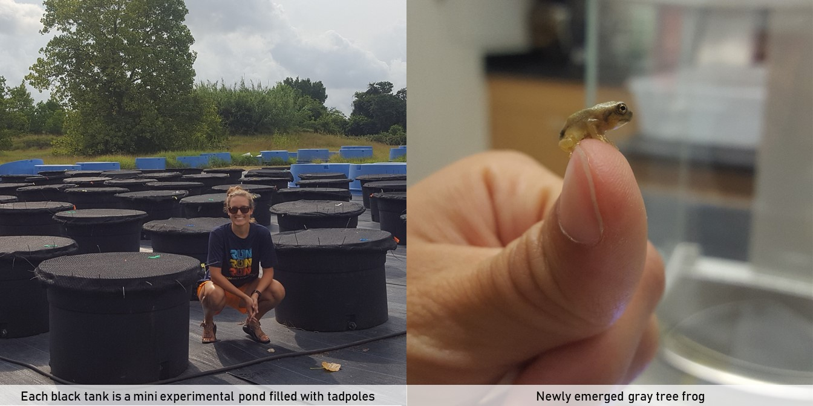

Last summer, I performed an experiment where I created 60 mini experimental ponds in black tanks (pictured below), filled the tanks with tadpoles, and monitored the tanks daily to collect freshly emerged frogs (also picutred). The treatments imposed on the tanks were designed to mimic some biological changes we're expected to see with climate change.

The frogs I collected represented the data for this project. The number that came from each tank and each individual frog's weight and date of emergence were the main response variables for this experiment. Without getting too much into the details of the biology or motivation behind this project, here is an overview of the data processing, visuals, and analysis. 

```{r, echo = FALSE, out.width = '100%'}

```


```{r setup, include = FALSE}
knitr::opts_chunk$set(echo = TRUE)

## Set working directory and clear memory
setwd("C:\\Users\\Shannon\\Desktop\\GitHub Repos\\competition_mesocosm_git")
rm(list = ls(all = T))

## Load required packages
library(lme4)
library(car)
library(gridExtra)
library(cowplot)
library(tidyverse)
library(multcomp)
library(wesanderson)

## Load universal plotting elements
mytheme <- theme(panel.background = element_blank(),
                 panel.grid.minor = element_blank(), 
                 panel.grid.major = element_blank(),
                 axis.text  = element_text(size = rel(1.3),colour = "black"),
                 axis.title = element_text(size = rel(1.5)),
                 axis.line  = element_line(colour = "black"))
###---LOAD DATA----------------------------------------------

## Treatment assignments for each tank
treatments <- read.csv("raw_tanks.csv", header = T)

## Tidy-ed raw metamorph data - 1 row per metamorph collected
ind_results <- read.csv("individual_results.csv", header = T)
ind_results$date <- as.Date(ind_results$date)

## Tank results (1 line per tank for 5 key response variables)
tank_results <- read.csv("tank_results.csv", header = T)

## Means and SEs for key variables
trt_means <- read.csv("trt_means.csv", header = T)  # made by copy-pasting above dfs together manually

###---REDUNDANT VARIABLE FORMATTING--------------------------

## Put factor levels in intuitive order for all dfs
ind_results$sync  <- factor(ind_results$sync, levels = c("low", "med", "high"))
ind_results$order <- factor(ind_results$order, levels = c('early', 'same', 'late', 'cont'))

tank_results$sync  <- factor(tank_results$sync, levels = c("low", "med", "high"))
tank_results$order <- factor(tank_results$order, levels = c('early', 'same', 'late', 'cont'))

trt_means$sync  <- factor(trt_means$sync, levels = c("low", "med", "high"))
trt_means$order <- factor(trt_means$order, levels = c('early', 'same', 'late', 'cont'))

```

## View raw data

First, a look at my raw data. Each row represents one frog. Tank refers to which tank number the frog came from and "block", "trt", "order" and "sync" are four treatment identifiers for each tank. "timetoemerge" is simply the number of days between when the tadpoles were added to the tank and when that particular frog emerged. This snippet shows the first and last 5 rows of the dataset. I checked on these tanks every day for 152 days and collected and weighed 1400 frogs. It was a lot of work!

```{r, echo = F}
ind_results$X <- NULL
ind_results$species <- NULL
ind_results$doy <- NULL
```
```{r, echo = T}
ind_results[c(1:5, 1383:1388),]
```

## Data processing

First thing to do is summarize results by tank. Here, I count the number of frogs that comes from each tank and calculate five response variables: proportion survival, cumulative biomass, mean per capita mass, mean per capita time to emergence, and variation in time to emergence. 
```{r, warning = F}

## Add a column of ones to sum as a counting mechanism
ind_results$ones <- 1

## Biomass is the sum weight of all frogs that come out of a particular tank
## This function replaces NA masses (cases where the frog died, RIP) with global mean mass
biomassxNA <- function(x) {
  x[which(is.na(x))] = mean(ind_results$mass_mg, na.rm = T)
  return(cumsum(x))
}

## For each tank, add a cumulative metamorph number and biomass
meta_accum <- ind_results %>%
  group_by(tank) %>%
  mutate(cumulative_metas = cumsum(ones),
         cumulative_biom  = biomassxNA(mass_mg)) # using the function written above

## This data frame still has one row per frog, but now has cumulative number and mass
meta_accum <- dplyr::select(meta_accum, date, tank, block, trt, order, sync, ones,
                    mass_mg, timetoemerge, cumulative_metas, cumulative_biom)

## Now, I summarize to one row per tank
tank_results <- meta_accum %>%
  group_by(tank) %>%
  summarize(surv = max(cumulative_metas)/45,  # final number of frogs
            biom = max(cumulative_biom),      # final cumulative mass of all frogs
            mass = mean(mass_mg, na.rm = T),  # mean individual mass of frogs
            emer = mean(timetoemerge),        # mean time to emergence for frogs
            emsd = sd(timetoemerge))          # variation in time to emergence

## Add tank treatment info back in
tank_results <- inner_join(tank_results, treatments, by = 'tank')

## Select relevant columns and make 1 row per tank
tank_results <- as.data.frame(unique(dplyr::select(tank_results, tank, block, trt, order,
                                                   sync, surv, biom, mass, emer, emsd)))

```

The resulting data frame (snippet below) has one row per tank. "block", "trt", "order", and "sync" give information about the treatment assigned to the tank. "surv", "biom", "mass", "emer" and "emsd" are response variables I measured/calculated.

```{r, echo = T}
head(tank_results)
```

I then group the tanks by treatment ('trt') and calculate means and variance measures (standard deviation, standard error, and 95% confidence intervals) for each of the 5 response variables. This part isn't shown, but a snippet of the resulting dataframe is below.

```{r, echo = F}
trt_means1 <- trt_means
trt_means1$cont <- NULL
trt_means1$adj  <- NULL
```
```{r, echo = T}
head(trt_means1)
```

## Figures

Now we're ready to take a look at the results! For each of the five response variables, I make a figure that looks like this. This one shows proportion survival. Here, the x-axis and colors represent the two aspects of my treatments ('order' and 'sync'). The dashed lines represent control values which correspond to each level of 'sync'. 

```{r, echo = T, warning = F, fig.align='center'}

surv_means <- ggplot(subset(trt_means, subset = (variable == 'surv' & order != 'cont')),
                     # synchrony as color, fill, and shape so color of lines match points and it's b/w friendly
                     aes(x = order, y = mean, group = sync, fill = sync, color = sync, shape = sync)) +   
  
  # 3 horizontal lines to show control baselines- colors matching synchrony level
  geom_hline(yintercept = 0.58, size = 1, linetype = 'dashed', color = "#fbb973") + 
  geom_hline(yintercept = 0.69, size = 1, linetype = 'dashed', color = "#f96968") +
  geom_hline(yintercept = 0.62, size = 1, linetype = 'dashed', color = "#4b1d1d") + 
  
  # lines connecting points
  geom_line(size = 0.7, position = position_dodge(width = 0.2)) +
  
  # error bars on points
  geom_errorbar(size = 1, position = position_dodge(width = 0.2),                   
                aes(ymin = mean - se, ymax = mean + se, width = 0)) +  
  
  # points- color = 'black' only makes a black outline on points
  geom_point(size = 5, color = 'black', position = position_dodge(width = 0.2)) +   
  
  # axis and legend labels
  labs(shape = "hatching\nsynchrony", 
       fill = 'hatching\nsynchrony', 
       color = "hatching\nsynchrony",
       x = "mean Hyla hatching (relative to Rana)",
       y = "proportion survival") +
  
  # style elements
  theme(legend.position = c(0.1, 0.22),
        axis.title = element_text(size = 12),
        axis.text  = element_text(size = 10)) +
  
  # adding fun Wes Anderson color scheme
  scale_fill_manual(values = wes_palette(n = 3, name = "GrandBudapest1")) +
  scale_color_manual(values = wes_palette(n = 3, name = "GrandBudapest1")) +
  scale_shape_manual(values = c(21, 24, 23))  
surv_means

```

##  
## All response variables together

Here, I've reproduced the above figure for each of the 5 response variables and stitched them together. These results are very exciting! But you'll just have to take my word for it, because I'm not not going to get into the nitty gritty biology of it here. 

```{r, echo = F, warning = F, fig.height=9, fig.width=11, fig.align='center'}

## BIOMASS
biom_means <- ggplot(subset(trt_means, subset = (variable == 'biom' & order != 'cont')), 
                     aes(x = order, y = mean, color = sync, shape = sync, fill = sync, group = sync)) + mytheme +
  #geom_point(data = subset(survivors, subset = (order != 'cont')), aes(x = order, y = biomass, fill = sync, shape = sync),
  #           position = position_dodge(width = 0.1)) + 
  geom_hline(yintercept = 6127, size = 1, linetype = 'longdash', color = "#fbb973") +
  geom_hline(yintercept = 6103, size = 1, linetype = 'dashed', color = "#f96968") +
  geom_hline(yintercept = 5035, size = 1, linetype = 'dashed', color = "#4b1d1d") +
  geom_line(size = 0.7, position = position_dodge(width = 0.2)) +
  geom_errorbar(size = 1, position = position_dodge(width = 0.2),
                aes(ymin = mean - se, ymax = mean + se, width = 0)) +
  geom_point(size = 5, position = position_dodge(width = 0.2), color = "black") +
  ylab("total biomass export (mg)") + 
  xlab('mean Hyla hatching (relative to Rana)') +
  theme(legend.position = 'none',
        axis.title = element_text(size = 12),
        axis.text  = element_text(size = 10)) +  
  scale_fill_manual(values = wes_palette(n = 3, name = "GrandBudapest1")) +
  scale_color_manual(values = wes_palette(n = 3, name = "GrandBudapest1")) +
  scale_shape_manual(values = c(21, 24, 23))


## MASS
mass_means <- ggplot(subset(trt_means, subset = (variable == 'mass' & order != 'cont')), 
                     aes(x = order, y = log(mean), color = sync, group = sync, fill = sync, shape = sync)) + mytheme +
  geom_hline(yintercept = log(236.5), size = 1, linetype = 'dashed', color = "#fbb973") +
  geom_hline(yintercept = log(197.4), size = 1, linetype = 'dashed', color = "#f96968") +
  geom_hline(yintercept = log(177.2), size = 1, linetype = 'dashed', color = "#4b1d1d") +
  geom_line(size = 0.7, position = position_dodge(width = 0.2)) +
  geom_errorbar(size = 1, position = position_dodge(width = 0.2),
                aes(ymin = log(mean - se), ymax = log(mean + se), width = 0)) +
  geom_point(size = 5, position = position_dodge(width = 0.2), color = "black") +
  ylab("log per capita mass (mg)") + 
  xlab('mean Hyla hatching (relative to Rana)') +
  theme(legend.position = 'none',
        axis.title = element_text(size = 12),
        axis.text  = element_text(size = 10)) +  
  scale_fill_manual(values = wes_palette(n = 3, name = "GrandBudapest1")) +
  scale_color_manual(values = wes_palette(n = 3, name = "GrandBudapest1")) +
  scale_shape_manual(values = c(21, 24, 23))

## EMERGENCE
emer_means <- ggplot(subset(trt_means, subset = (variable == 'emer' & order != 'cont')), 
                     aes(x = order, y = mean, color = sync, shape = sync, fill = sync, group = sync)) + mytheme +
  geom_hline(yintercept = 33.4, size = 1, linetype = 'dashed', color = "#fbb973") +
  geom_hline(yintercept = 43.8, size = 1, linetype = 'dashed', color = "#f96968") +
  geom_hline(yintercept = 55.8, size = 1, linetype = 'dashed', color = "#4b1d1d") +
  geom_line(size = 0.7, position = position_dodge(width = 0.1)) +
  geom_errorbar(size = 1, position = position_dodge(width = 0.1),
                aes(ymin = mean - se, ymax = mean + se, width = 0)) +
  geom_point(size = 5, position = position_dodge(width = 0.1), color = "black") +
  ylab("days to emergence") + 
  xlab('mean Hyla hatching (relative to Rana)') +
  theme(legend.position = 'none',
        axis.title = element_text(size = 12),
        axis.text  = element_text(size = 10)) +  
  scale_fill_manual(values = wes_palette(n = 3, name = "GrandBudapest1")) +
  scale_color_manual(values = wes_palette(n = 3, name = "GrandBudapest1")) +
  scale_shape_manual(values = c(21, 24, 23))

## EMERGENCE SD
emsd_means <- ggplot(subset(trt_means, subset = (variable == 'emsd' & order != 'cont')), 
                        aes(x = order, y = mean, color = sync, shape = sync, fill = sync, group = sync)) + mytheme +
  geom_hline(yintercept = 10.3, size = 1, linetype = 'dashed', color = "#fbb973") +
  geom_hline(yintercept = 16.88, size = 1, linetype = 'dashed', color = "#f96968") +
  geom_hline(yintercept = 15.11, size = 1, linetype = 'dashed', color = "#4b1d1d") +
  geom_line(size = 0.7, position = position_dodge(width = 0.2)) +
  geom_errorbar(size = 1, position = position_dodge(width = 0.2),
                aes(ymin = mean - se, ymax = mean + se, width = 0)) +
  geom_point(size = 5, position = position_dodge(width = 0.2), color = "black") +
  ylab("s.d., days to emergence") + 
  xlab('mean Hyla hatching (relative to Rana)') +
  theme(legend.position = 'none',
        axis.title = element_text(size = 12),
        axis.text  = element_text(size = 10)) +  
  scale_fill_manual(values = wes_palette(n = 3, name = "GrandBudapest1")) +
  scale_color_manual(values = wes_palette(n = 3, name = "GrandBudapest1")) +
  scale_shape_manual(values = c(21, 24, 23))

fig1 <- plot_grid(surv_means, biom_means, mass_means, emer_means, emsd_means,
          nrow = 2, labels = c("A", "B", "C", "D", "E"))
fig1
```

##   
I really like this figure because it reminds me of ice cream. Here, we see the mean and variation in how long individual frogs took to emerge broken down by treatment.

```{r, echo = F, warning = F, fig.height = 6, fig.width = 8, fig.align='center'}
fig4 <- ggplot(ind_results, aes(x = order, y = date, color = sync, fill = sync)) +
  geom_boxplot(size = 1, alpha = 0.65, position = position_dodge(0.85)) +
  scale_color_manual(values = wes_palette(n = 3, name = "GrandBudapest1")) +
                     #limits = rev(levels(ind_results$sync))) +
  scale_fill_manual(values = wes_palette(n = 3, name = "GrandBudapest1")) +
                    #limits = rev(levels(ind_results$sync))) +
  labs(fill = 'hatching\nsynchrony', color = 'hatching\nsynchrony') +
  ylab('date of emergence') + xlab('mean arrival (relative to Rana)') +
  coord_flip() + 
  scale_x_discrete(limits = rev(levels(ind_results$order)))
fig4

```

# Analysis

I spent at least 40 hours on the stats for this project. Testing different error structures, validating model assumptions, comparing AICs, adding and dropping interactive terms and random effects, etc. Here, I'll give an overview of what that process looked like for one of the five response variables.

## Checking model assumptions

Is data normally distributed? Yes.
```{r, echo = T, warning = F}

qqp(tank_results$surv, 'norm') 

```

Are variances equal across treatments? Yes.
```{r, echo = F}
tank_results2 <- subset(tank_results, subset = (order != 'cont'))
```

```{r, echo = T, warning = F}

ggplot(tank_results2, aes(x = order, y = surv)) +
  geom_boxplot() +
  facet_grid(~ sync)
```

## Coarse models

Here, I change big things, like adding/dropping explanatory (treatment) variables, random effects for replicates, and interaction terms
```{r, echo = T, warning = F}

# only one explanatory variable (order). bad fit
m1 <- lmer(data = tank_results2, surv ~ order + (1|block), REML = F)

# only one explanatory variable (sync). bad fit
m2 <- lmer(data = tank_results2, surv ~ sync + (1|block), REML = F)

# order and sync but no interaction, block as random effect
m3 <- lmer(data = tank_results2, surv ~ sync + order + (1|block), REML = F)

# order and sync but no interaction, block as fixed effect
m4 <- lm(data = tank_results2, surv ~ sync + order + block)

# interaction between order and sync, block as random effect
m5 <- lmer(data = tank_results2, surv ~ sync * order + (1|block), REML = F)

# interaction between order and sync, block as fixed effect
m6 <- lm(data = tank_results2, surv ~ sync * order + block)

```

## Model selection

I use AIC values to compare the different models. m5 has the lowest AIC, so is the best fitting model of these six. 

```{r, echo = T, warning = F}

# comparing m1-6 
anova(m1, m2, m3, m4, m5, m6)

```

At this point, I made several new versions of the chosen m5 with finetune changes and compared the model fits again. This includes things like trying different data structures, coding explanatory variables as numeric vs. factors vs. ordered factors, etc. But we'll skip that part for now and move on to model diagnostics.

## Model diagnostics 

Lastly, I take a closer look at the chosen model. I normally check out these and other diagnostics for all candidate models, but here are just the highlights.

```{r, echo = T, warning = F}

# the tightness of the points to the line here validates that our data was normally distributed
res_m5 <- residuals(m5)
qqnorm(res_m5)
qqline(res_m5)

# this plots our model predicted values against actual values-- looks pretty good!
plot(predict(m5), tank_results2$surv, xlim = c(0, 1), ylim = c(0, 1))
abline(a = 0, b = 1)  

```
